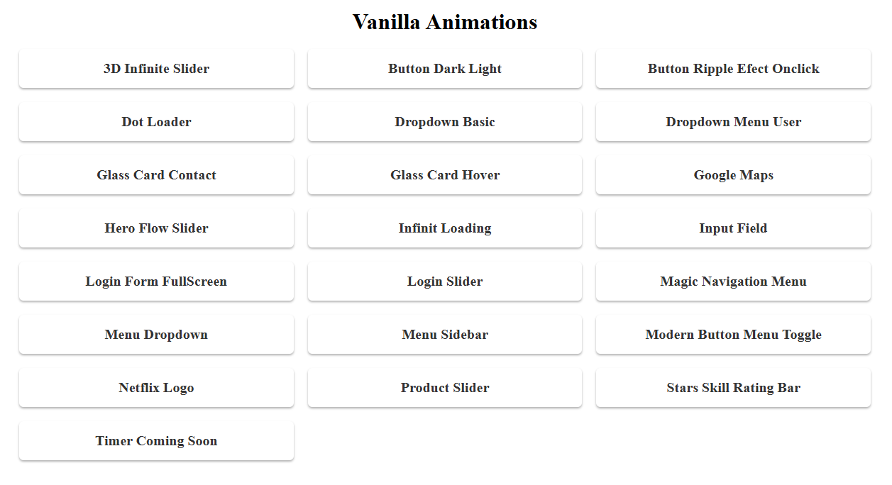
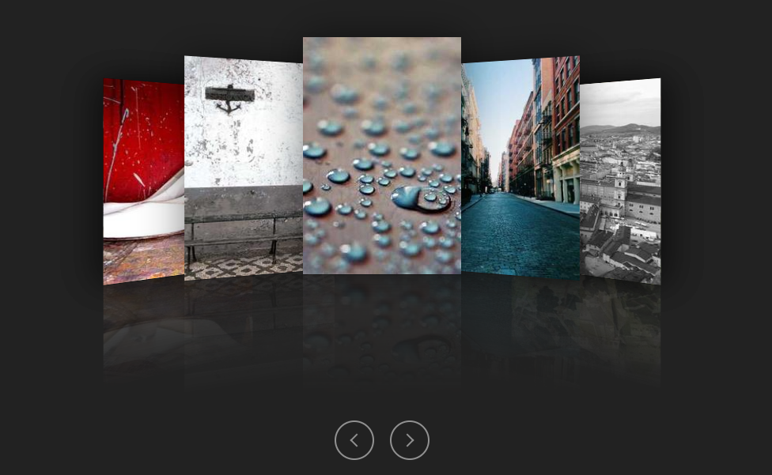

# Animations Repository

<p align="center">
   
   
</p>

Welcome to the **Animations Repository**, where you will find two distinct animation projects:
1. **Vanilla Animations** ([Demo](https://animations-eosin.vercel.app/)): A pure JavaScript, Html and css implementation of animations.
2. **React Componentized Animations** ([Demo](https://react-animations-lilac.vercel.app/)): A React-based project where animations are componentized for better reusability and structure.

## Running the Projects

1. Clone the repository:
   ```bash
   git clone https://github.com/adrianodev97/Animations.git
   ```

### Vanilla Animations

2. Navigate to the **Vanilla** folder:
    ```bash
    cd Animations/vanilla-animations
    ```

3. Open **index.html** in your preferred browser or use a simple server:
   - Example using **Live Server** vscode plugin


### React Animations

2. Navigate to the **React** folder:
    ```bash
    cd Animations/react-animations
    ```

3. Install the dependencies:
    ```bash
    bun install
    ```

4. Run the project:
    ```bash
    bun dev
    ```
